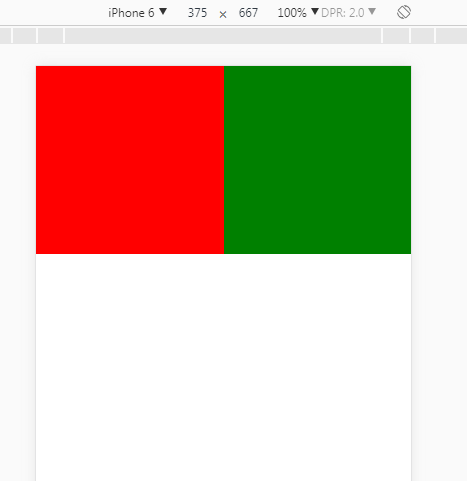
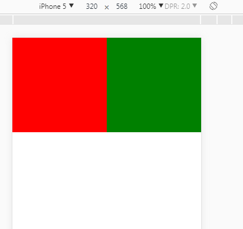

###巧用margin/padding的百分比值实现高度自适应（多用于占位,避免闪烁） 

转载[https://segmentfault.com/a/1190000004231995](https://segmentfault.com/a/1190000004231995)

####贯穿本文的知识点
当`margin/padding`取形式为百分比的值时,无论是其`left/right`,还是`top/bottom`,都是`以父元素的width`为参照物的！

现在有个需求,在移动端,不管怎么样,都需要两个正方形并列,占据一行

如图:





```html
<!DOCTYPE html>
<html lang="en">

<head>
    <meta charset="UTF-8">
    <meta name="viewport" content="width=device-width,initial-scale=1.0,maximum-scale=1.0,minimum-scale=1.0,user-scalable=no">
    <title>Document</title>
    <style>
    * {
        padding: 0;
        margin: 0;
    }
    
    li {
        float: left;
        width: 50%;
        position: relative;
        padding-top: 50%;
        list-style-type: none;
    }
    
    li img {
        position: absolute;
        top: 0;
        left: 0;
        width: 100%;
        height: 100%;
    }
    </style>
</head>

<body>
    <ul>
        <li style="background: red;">
            
        </li>
        <li style="background: green;">
            
        </li>
        <li style="background: green;">
            
        </li>
        <li style="background: red;">
            
        </li>
    </ul>
</body>

</html>

```

以上初步达到了要求,但是上述方案的缺陷在于不能使用`max-height`.因为`max-height`只能限制内容高度,而不能限制`padding`.也不能用`box-sizing: border-box`来解决该问题.所以需要用伪元素来撑开高度,同时伪元素又是容器内容,所以会受`max-height`的制约

```html
<!DOCTYPE html>
<html lang="en">

<head>
    <meta charset="UTF-8">
    <meta name="viewport" content="width=device-width,initial-scale=1.0,maximum-scale=1.0,minimum-scale=1.0,user-scalable=no">
    <title>Document</title>
    <style>
    * {
        padding: 0;
        margin: 0;
    }
    
    li {
        float: left;
        width: 50%;
        position: relative;
        list-style-type: none;
    }

    li:after {
        display: block;
        content: "";
        padding-top: 100%;
    }
    
    li img {
        position: absolute;
        top: 0;
        left: 0;
        width: 100%;
        height: 100%;
    }
    </style>
</head>

<body>
    <ul>
        <li style="background: red;">
            
        </li>
        <li style="background: green;">
            
        </li>
        <li style="background: green;">
            
        </li>
        <li style="background: red;">
            
        </li>
    </ul>
</body>

</html>
```