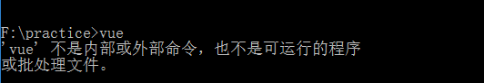

在64位window中下载nodejs,需要注意一些事情,有时候你下载了对应的x64的nodejs,可是nodejs并不能很好的运行(虽然我不知道是什么原因,但绝对是与环境变量配置无关的原因).

比如我通过x64的nodejs来npm一个vue-cli,但是当我尝试运行vue命令的时候,遇到如下场景

所以可以尝试的一个解决方法是写在x64的nodejs,安装x86的nodejs(也就是32位的nodejs)